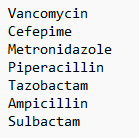
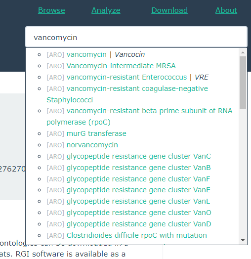
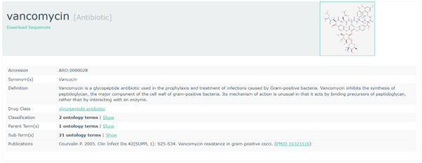
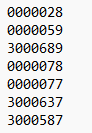
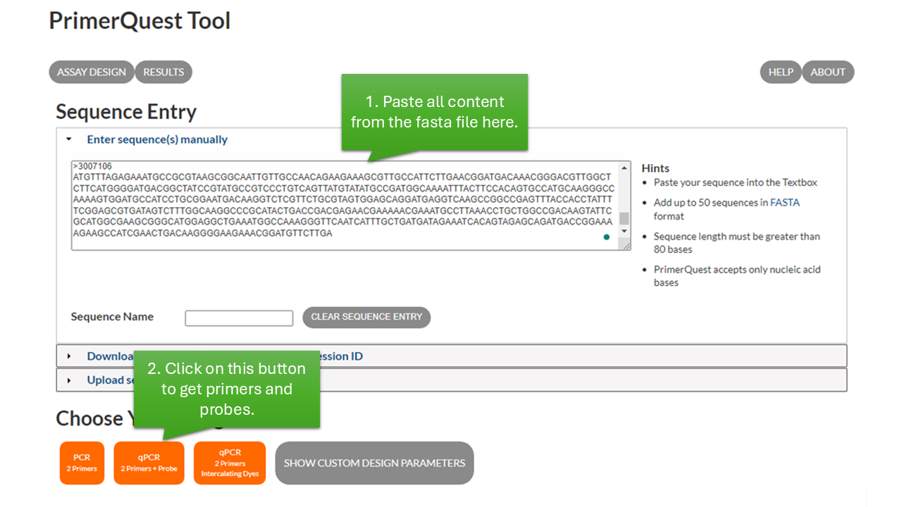
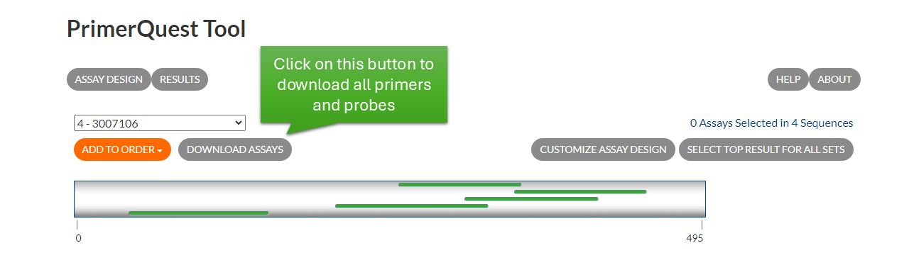

# Drug_list_to_ARG_primers
Metagenomic sequencing results can guide the design of qPCR primers and probes. This is a pipeline for designing qPCR primers and probes targeting the ARGs of interest based on metagenomic sequencing results and a list of antibiotics of interest. 

## Description
Metagenomic sequencing and qPCR are two mainstream methods for detecting antibiotic resistance genes (ARGs) in complex DNA samples (e.g., wastewater, stool, etc.). Metagenomic sequencing can detect a wide range of ARGs without targeting them, while qPCR requires primer and probe design for each ARG. However, metagenomic sequencing is more expensive, harder to perform, and less sensitive than qPCR. Therefore, for routine ARG surveillance, it is more practical to use metagenomic sequencing at the beginning to determine the range of target ARGs and design qPCR primers and probes accordingly. In addition, metagenomic sequencing can detect the mutated sites in ARGs. To achieve better qPCR efficiencies, these mutated sites should be avoided in primer and probe design. Hundreds of ARGs may be found in metagenomic sequencing, but not all ARGs should be included in routine qPCR surveillance. This pipeline fills the gap between metagenomic sequencing and qPCR primer design for routine surveillance. With a drug list of interest and the ARG detection results from metagenomic sequencing, this pipeline generates qPCR primers and probes targeting the ARGs of most concern in the sample while avoiding the mutated sites.

## Package Requirements
### Python Packages  
* [Owlready2](https://github.com/pwin/owlready2)  
* [PyVCF](https://github.com/jamescasbon/PyVCF)
* [Pandas](https://anaconda.org/anaconda/pandas) (v1.3.5 or below)
### Bioinformatic Tools  
* [Samtools](https://www.htslib.org/) (v1.13 or above)  
* [FreeBayes](https://github.com/freebayes/freebayes)  
* [Bowtie2](https://github.com/BenLangmead/bowtie2) (or any other read mapping tool that can map fastq to a reference fasta file to generate a sam/bam file)
* [IGV](https://igv.org/)

## Workflow
### 1. Map fastq to fasta  
Here is an example using Bowtie2 to map paired fastq raw reads generated by Illumina sequencing to a fasta file containing all ARGs of interest. Users can use `ARG_with_NH8B.fasta` in this repository as the reference for ARG read mapping. These sequences were downloaded from [CARD](https://card.mcmaster.ca/), cleaned, and labeled by their AROs. Reading filtering before mapping using tools such as [PriceSeqFilter](https://derisilab.ucsf.edu/software/price/) is highly recommended. A more detailed read mapping protocol can be found in [our manuscript](https://www.biorxiv.org/content/10.1101/2024.07.30.605462v1.abstract).
```
bowtie2 -x [PATH_TO_REFERENCE_FASTA] -1 [PAIRED_FASTQ_FILE_1] -2 [PAIRED_FASTQ_FILE_2] -a --very-sensitive -S [OUTPUT_SAM_PATH]
```
### 2. Convert .sam file to .bam file and get read coverage
Now we need to use Samtools to convert .sam file to .bam file.  
```
samtools view -Sb -o [OUTPUT_BAM_FILE_PATH] [INPUT_SAM_FILE_PATH]
```
The .bam file can be sorted and indexed to be viewable in [IGV](https://igv.org/).
```
samtools sort [INPUT_BAM_FILE_PATH] -o [OUTPUT_SORTED_BAM_FILE_PATH]
```
```
samtools index [SORTED_BAM_FILE_PATH]
```
Read coverage of each ARG can be summarized by samtools coverage using the sorted .bam file as input. Here, we use `--ff 0` to remove the restriction of secondary mapping.
```
samtools coverage --ff 0 -o [OUTPUT_COVERAGE_TSV_FILE_PATH] [INPUT_BAM_FILE_PATH]
```
An additional step to remove the secondary flags in the read mapping file.
```
samtools view --remove-flags 0x100 -b [INPUT_BAM_FILE] >[OUTPUT_CLEANED_BAM_FILE]
```
### 3. Get mutated sites in all mapped ARGs
FreeBayes is used in this step to obtain the mutated sites in different ARGs detected in the given sample. A .vcf file will be generated to summarize all mutated sites.
```
freebayes -f [REFERENCE_FASTA_FILE] [CLEANED_BAM_FILE] >[OUTPUT_VCF_FILE]
```
### 4. Obtain AROs for the drugs of interest
Not all ARGs are equal. Assume we are interested in detecting ARGs that confer resistance to a few commonly used drugs. The first step is to search for those drugs in the database. Here, we use [CARD](https://card.mcmaster.ca/) to search for antibiotics and ARGs. Assume we have a list of drugs (as listed in `example/Drug_name_example.txt`):  
  


We can search for these names on [CARD](https://card.mcmaster.ca/):  



The ARO of the corresponding drug is listed as labeled below (e.g.: 0000028 for vancomycin):



Summarize all AROs in a .txt file, as shown in `example/Drug_ARO_list_example.txt`:



Now, this .txt file containing all AROs of the drugs of interest can be used as the input for `drug_to_corresponding_ARGs.py`. This code also requires the .tsv file generated in step 2 containing all ARGs mapped in the given sample. This code will generate a .fasta file containing the sequence of the ARGs detected in the given sample that confer resistance to the listed drugs.
```
cd PATH_TO/Drug_list_to_ARG_primers/  
```
```
python3 drug_to_corresponding_ARGs.py -i [INPUT_DRUG_ARO_LIST] -c [INPUT_COVERAGE_TSV_FILE] -p [COVERAGE_PERCENTAGE_THRESHOLD_DEFAULT_70] -o [OUTPUT_FASTA_FILE]
```
### 5. Design qPCR primers and probes using IDT PrimerQuest Tool
In this step, we use the .fasta file generated in step 4 as the input sequence for [PrimerQuest Tool](https://www.idtdna.com/Primerquest/Home/Index) to design corresponding primers and probes.



After designing primers and probes, download all primers and probes by clicking on the `DOWNLOAD ASSAYS` button:



Now, the primers and probes targeting the ARGs of interest are designed. 
### 6. Screen primers and probes based on mutations detected in the sample
Mutation happens frequently in microbial communities. Most of the time, ARGs detected in a sample cannot be identical to the reference sequence. Here, we add a primer screening step to exclude the primer sets that may align with the mutated sites of the ARGs in a given sample using `primer_screening.py`. The input files include: 1) The .xls file downloaded from IDT PrimerQuest Tool containing all designed primers and probes; 2) The .fasta file generated in step 4 for primer design containing the reference sequences of the ARGs of interest; 3) The .vcf file generated in step 3 containing all mutated sites on the ARGs detected in the given sample. The output of this code is a list of primers and probes that will not cover the mutated sites in the given sample. These primers and probes can be tested in a wet lab and be applied for routine surveillance.
```
cd PATH_TO/Drug_list_to_ARG_primers/  
```
```
python3 primer_screening.py -p [IDT_PRIMER_QUEST_OUTPUT_XLS] -f [FASTA_FILE_FOR_PRIMER_DESIGN] -v [VCF_FILE_CONTAINING_ALL_MUTATED_SITES] -o [OUTPUT_XLSX_FILE_PATH]
```

